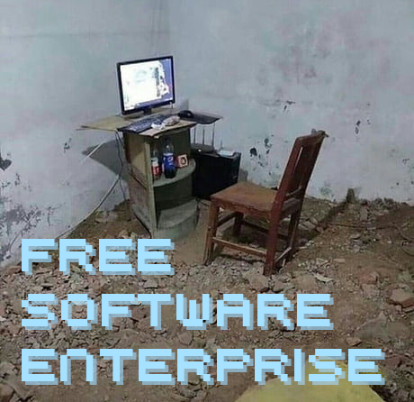
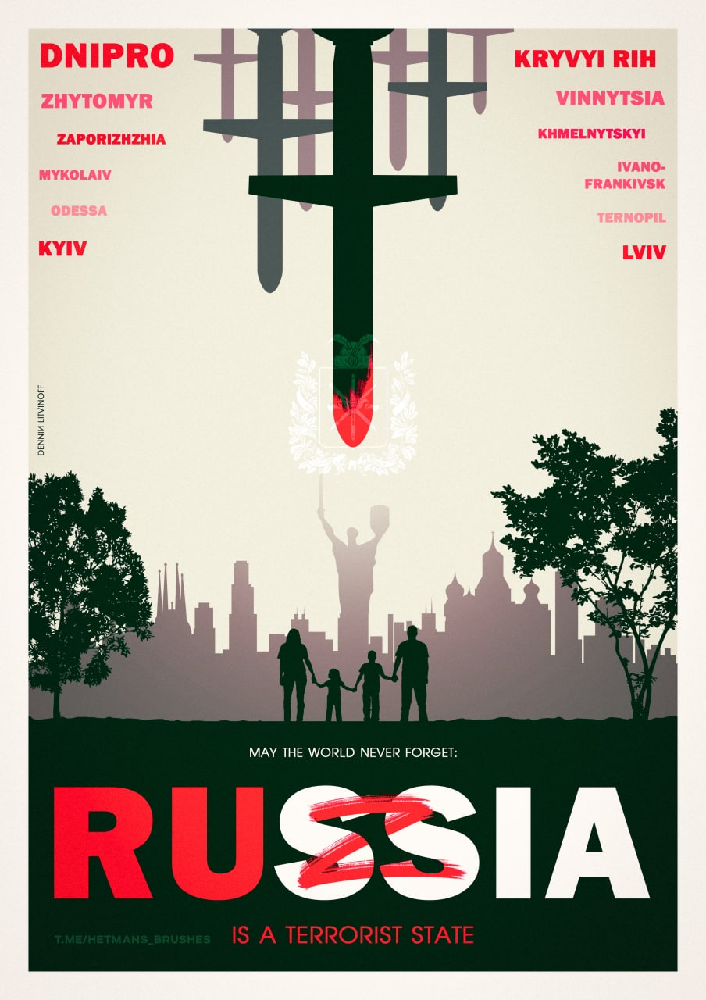

<table>
<tr>
<td></td>
<td>

* I'm a yet another software developer. I like to code in C, C++ and black magic. I'm interested in the 3D graphics, physics, embedded stuff and neural networks.

* My working beast is Asus Expertbook B9400CEA with `i7-1165G7@2.80GHz/32 Gb RAM` running Arch Linux.

</td>
</tr>
</table>

### russia is a terrorist state

<table>
<tr>
<td>

</td>
<td>
On 24th Feburary 2022 russia launched a full-scale invasion of Ukraine. During the time of the invasion russia brings heavy desctruction to the Ukrainian cities like <a href="https://www.bbc.com/news/world-europe-61179093">Mariupol</a>, <a href="https://www.bbc.com/news/world-europe-61856229">Kharkiv</a> and others. The russian missile strikes hit apartment buildings and houses with civilian people inside [<a href="https://www.nbcnews.com/news/world/ukraine-apartment-building-russia-missiles-rubble-chasiv-yar-rcna37488">0</a>, <a href="https://www.bbc.com/news/av/world-europe-63191478">1</a>, <a href="https://www.euronews.com/2022/10/02/the-blast-threw-me-into-the-wall-mykolaiv-residents-describe-nightly-russian-missile-strik">2</a>], at night, among the other cruelties [<a href="https://www.washingtonpost.com/world/2022/10/09/izyum-rape-torture-occupation-russia/">0</a>, <a href="https://news.sky.com/story/ukraine-claims-terrible-torture-chamber-discovered-in-town-newly-liberated-from-russian-forces-12713217">1</a>, <a href="https://en.wikipedia.org/wiki/Bucha_massacre">2</a>] is a pure sign of the terrorist nature of the russian aggressive campaign. Many Ukrainians and people all around the world help the Armed Forces of Ukraine and volunteers to save the lives and stop russia by sending donations to different funds. One of the most famous one is the <a href="https://savelife.in.ua/en/">Come Back Alive</a> fund. Even a small donation can save lives and help kick the russian terrorists out of the Ukraine faster.

 

</td>
</table>

### Contacts:

- :email: email: <sh1r4s3@mail.si-head.nl>
- :globe_with_meridians: www: http://si-head.nl
- :chicken: twitter: [@sh1r4s3](https://twitter.com/sh1r4s3)
